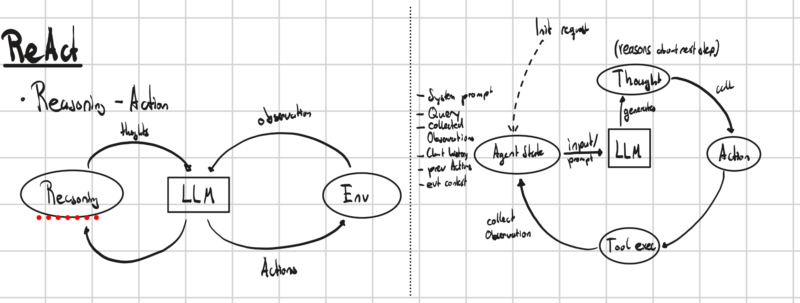

# Agents - Tools

Answer to question:

## When do I use a RAG pipeline and when do I use an agent instead? What is the deciding factor?

RAG and Agents are two tools used for conceptually different probelm types. They each do their tasks well, but are designed for different tasks entierly. 

**RAG** is designed, to solve the problem of giving a model simply *access* to more recent or personal data. The generation and reasoning capabilities stay the same, the likely hood of hallucination dicreases.

**Agents pipelines** are designed, to solve more dynamic problems, where somethimes the model needs access to different tools and capabilities. This increases the capability of more flexible or acurate reasoning. An agent runs in a ReAct cycle (Reasoning Action). So if a problem needs to be solved, that needs this ReAct Cycle, it can be solved by an Agents pipeline.

The decision, on which system you should opt for, is almost always best decided, by the criteria of simplicity.

## ReAct Loop Diagram
Draw or write out the ReAct loop as a cycle. Label each stage. Must be produceable from memory.  

## Frame work Decision - LangChain
I will go for the LangChain - LangGraph. This is simply due to it being an already existing well documented framework. I am aware it includes quite a bit of bloat, but this is acceptable. I will use it in first line only for the first few projects.

I give myself to use an other secundary framework afterwards, iff i choos it fits better, for something certain.
